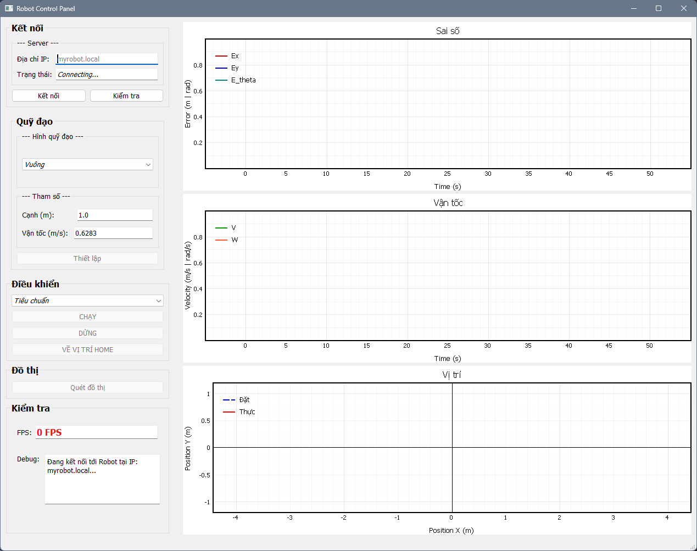

# DMRobot

`DMRobot` là dự án điều khiển robot di động với mô hình **ESP32-S3 + STM32F103**, dùng **WebSocket/WiFi** để giao tiếp giữa app web và STM32 qua ESP32.

## Tổng quan

Dự án gồm hai phần chính:

- `firmware/esp`: firmware cho ESP32-S3 DevKitM-1 sử dụng PlatformIO và Arduino.
- `firmware/stm`: firmware cho STM32F103RCT6 với bộ xử lý điều khiển robot.

Ngoài ra, dự án còn có:

- `hardware/`: tài liệu PCB, sơ đồ mạch, file thiết kế board.
- `software/`: công cụ Python, GUI và script hỗ trợ kiểm tra/phân tích.
- `docs/`: ảnh và GIF minh họa app/robot.

## Tính năng chính

- Mô-đun ESP32-S3 làm gateway WiFi, chạy web server và WebSocket.
- Cầu nối UART giữa ESP32 và STM32 để gửi/nhận lệnh điều khiển.
- Hỗ trợ lệnh: `STOP`, `RUN`, `RETURN_HOME`, `SET_TRAJECTORY`, `SET_PATH`, `STATUS`.
- Giao tiếp JSON qua WebSocket để điều khiển và cấu hình từ app web.
- Chế độ WiFi AP với SSID mặc định `DMRobot_Net` và password `12345678`.
- Chế độ WiFi STA có thể cấu hình WiFi nhà sẵn trong `firmware/esp/src/main.cpp`.
- Giám sát trạng thái pin và trạng thái kết nối mạng.

## Giao diện

## Cấu trúc thư mục

- `docs/`
  - `app.png`: ảnh giao diện ứng dụng.
  - `DMRobot.gif`: GIF demo.
- `firmware/esp/`
  - `platformio.ini`: cấu hình PlatformIO cho ESP32-S3.
  - `src/main.cpp`: mã nguồn chính điều khiển WiFi, WebSocket, UART.
- `firmware/stm/`
  - STM32F103 firmware và mã nguồn điều khiển robot.
- `hardware/`
  - Thiết kế PCB, sơ đồ, file xuất Gerber và các tài liệu phần cứng.
- `software/`
  - Script Python và phần mềm hỗ trợ.

## Cài đặt và chạy

1. Mở `firmware/esp` với PlatformIO.
2. Chọn environment: `esp32-s3-devkitm-1`.
3. Kết nối ESP32-S3 và build/upload firmware.
4. Mở Serial Monitor với tốc độ `115200`.
5. Kết nối WiFi tới `DMRobot_Net` hoặc cấu hình WiFi STA trong `firmware/esp/src/main.cpp`.
6. Truy cập trang web điều khiển hoặc `myrobot.local` nếu mDNS hoạt động.

## Tùy chỉnh

- Thay đổi SSID/AP và mật khẩu trong `firmware/esp/src/main.cpp`:
  - `ROBOT_WIFI_SSID`
  - `ROBOT_WIFI_PASSWORD`
  - `MY_WIFI_SSID`
  - `MY_WIFI_PASSWORD`
- Điều chỉnh tốc độ UART và chân RX/TX cho ESP32-S3 cũng nằm trong `firmware/esp/src/main.cpp`.

## Ghi chú

- ESP32-S3 kết nối tới STM32 qua UART trên chân `RX_PIN = 40` và `TX_PIN = 39`.
- Firmware STM32 nằm trong `firmware/stm` và cần STM32CubeIDE hoặc tool tương thích để build.
